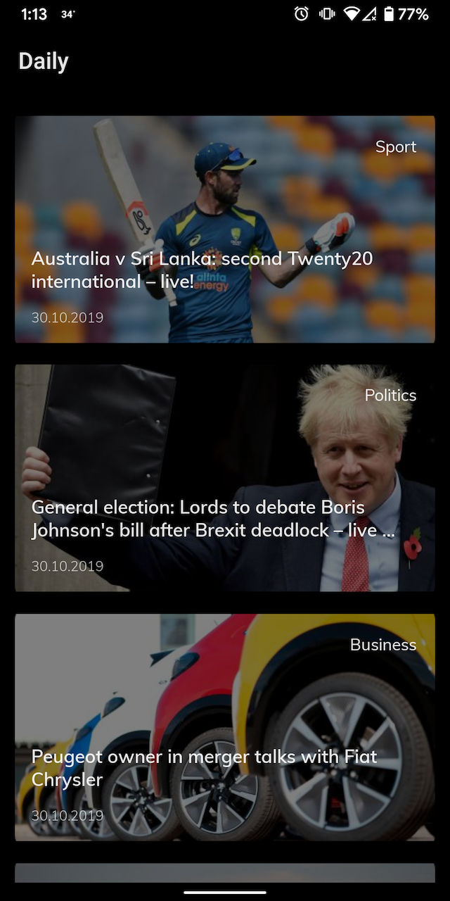

# daily

This is a news app with two screens. The api used is the [Guardian API](https://open-platform.theguardian.com/)

The first screen shows a feed of news items and the second screen can be opened to read the article in detail. 
The api key can be entered in the **API_KEY** config field of [build.gradle](daily/build.gradle) of the main app module.

The app is built using MVVM along with clean architecture, such that each operation is divided into a different module. They are,

1. domain - All business use cases are defined in this module
2. data - The module which decides from where to fetch the data, local or remote data source.
3. cache - Database module
4. remote - Retrofit module
5. presentation - Contains the viewmodels and Live data classes
6. daily(app) - Main module of the app which also contains the activities and ui related code. Also has the di setup.
7. core and common - These modules have generic kotlin and android specific code respectively.

### Third party libraries used
1. Architecture Components - ViewModel, LiveData, Room
2. RxJava2
3. Retrofit, OkHttp
4. Picasso
5. Dagger2

NOTE: If the tests fail to run, specifically Robolectric tests, please do a rebuild of the project and try again.

